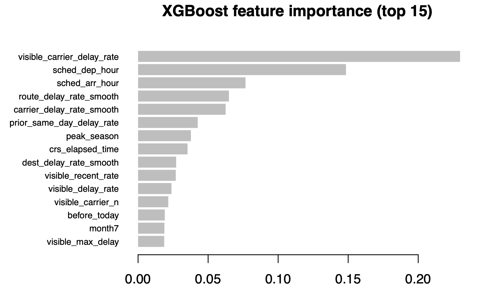

```{r, include=FALSE}
###########################
# STYLE EDITS: IGNORE THIS
###########################

# normally you'll want to include this with the libraries at the beginning of your document
knitr::opts_chunk$set(message = FALSE) # include this if you don't want markdown to knit messages
knitr::opts_chunk$set(warning = FALSE) # include this if you don't want markdown to knit warnings
knitr::opts_chunk$set(echo = FALSE) # set echo = FALSE to hide code from output

```

# Executive summary {.unnumbered}

# Introduction

The goal of this analysis is to predict whether or not a departing flight from Pittsburgh International Airport (airport code PIT) will be delayed based on only information available before the departure of the flight. The dataset is flight information from 2023 - 2025 extracted from the Airline On-Time Performance Data from the Bureau of Transportation Statistics of the U.S. Department of Transportation. In addition to metrics about flight delays, it also reflects commercial flight activity to and from PIT. Feature engineering was used to develop additional metrics based on initial exploratory data analysis. This analysis utilizes various machine learning methods in order to attempt this binary classification on a subset of the 2025 flights, including logistic regression (with and without LASSO regularization), XGBoost, random forest (with and without rebalancing), and an ensemble method that took an average of the predictions of these metrics (with and without weighting different methods). The metrics of model performance are training set misclassification rate, testing set misclassification rate, and area-under-the-curve (AUC). Based on the findings, ... **[insert conclusions here]**.

# Exploration

## Exploratory Data Analysis

```{r setup, include=FALSE}
library(tidyverse)
library(adabag)
library(caret)
library(gt)
library(e1071)
library(tidymodels)
library(here)
library(janitor)
library(lubridate)
library(pROC)
library(randomForest)
library(skimr)
library(scales)
library(forcats)
library(ranger)
library(patchwork)
library(glmnet)
library(xgboost)
```

```{r}
# Load data
flights2023 <- read_csv(here("data", "flights2023.csv")) |>
 clean_names()

flights2024 <- read_csv(here("data", "flights2024.csv")) |>
 clean_names()

test <- read_csv(here("data", "flights2025.csv")) |>
 clean_names()

test_visible <- read_csv(here("data", "flights2025_visible.csv")) |>
 clean_names() |>
  mutate(data_year = 2025)

test_guess <- read_csv(here("data", "flights2025_guess.csv")) |>
 clean_names() |>
  mutate(data_year = 2025)

# Build training set
train <- bind_rows(
 flights2023 |> mutate(data_year = 2023),
 flights2024 |> mutate(data_year = 2024)
)
```

```{r}
# Apply the same cleaning steps to each data frame so train and test sets are consistent
clean_flights <- function(df) {
 df |>
 clean_names() |>
 mutate(
 fl_date = as.Date(fl_date),
 dep_del15 = as.numeric(dep_del15),
 op_unique_carrier = as.factor(op_unique_carrier),
 origin = as.factor(origin),
 dest = as.factor(dest),
 sched_dep_hour = floor(crs_dep_time / 100),
 sched_arr_hour = floor(crs_arr_time / 100),
 month = as.factor(month),
 day_of_week = as.factor(day_of_week)
 )
}

train <- clean_flights(train)
test <- clean_flights(test)
test_visible <- clean_flights(test_visible)
test_guess <- clean_flights(test_guess)
```

```{r}
# Restrict to departures from PIT
train <- train |>
 filter(origin == "PIT")

test_visible <- test_visible |>
 filter(origin == "PIT")

test_guess <- test_guess |>
 filter(origin == "PIT")
```

```{r}
# Inbound flight features
# For each PIT departure, we try to match the same aircraft (tail + date) arriving at PIT
# earlier that day. Match rates: ~55% for training, ~15% for guess flights.
# For guess, only arrivals in flights2025_visible.csv have known arr_delay —
# guess-period arrivals are blanked out. The 85% with no match are overnighted
# or first-flight aircraft, which is itself informative (lower delay risk).
arrivals_train <- bind_rows(
  clean_flights(read_csv(here("data", "flights2023.csv"), show_col_types = FALSE)) |>
    filter(dest == "PIT") |> mutate(data_year = 2023),
  clean_flights(read_csv(here("data", "flights2024.csv"), show_col_types = FALSE)) |>
    filter(dest == "PIT") |> mutate(data_year = 2024)
)

# Only visible arrivals have non-NA arr_delay bc guess-period arrivals are blanked out
arrivals_test_visible <- clean_flights(
  read_csv(here("data", "flights2025_visible.csv"), show_col_types = FALSE)
) |> filter(dest == "PIT") |> mutate(data_year = 2025)

# For each (date, tail_num), keep the latest arriving flight as the inbound leg
make_inbound_lookup <- function(arrivals_df) {
  arrivals_df |>
    filter(!is.na(tail_num), tail_num != "", !is.na(arr_delay)) |>
    group_by(fl_date, tail_num) |>
    slice_max(crs_arr_time, n = 1, with_ties = FALSE) |>
    ungroup() |>
    select(fl_date, tail_num,
           inbound_arr_delay = arr_delay,  # minutes late on arrival
           inbound_arr_del15 = arr_del15,  # binary: arrived >= 15 min late
           inbound_crs_arr_time = crs_arr_time)  # scheduled arrival time
}

inbound_train <- make_inbound_lookup(arrivals_train)
inbound_visible <- make_inbound_lookup(arrivals_test_visible)
inbound_guess <- inbound_visible  # guess set uses visible-only lookup

join_inbound <- function(dep_df, inbound_df) {
  dep_df |>
    left_join(inbound_df, by = c("fl_date", "tail_num")) |>
    mutate(
      # min between scheduled inbound arrival and scheduled departure
      turnaround_mins = sched_dep_hour * 60 + (crs_dep_time %% 100) -
                          (inbound_crs_arr_time %/% 100 * 60 + inbound_crs_arr_time %% 100),
      # indicator (< 45 min scheduled buffer is risky)
      tight_turnaround = if_else(!is.na(turnaround_mins) & turnaround_mins < 45, 1L, 0L),
      # indicator (whether we found a matching inbound leg at all)
      # has_inbound = 0 could mean overnighted OR inbound after cutoff in guess set
      # so we keep it as context but don't include it in model_vars
      has_inbound = if_else(!is.na(inbound_arr_delay), 1L, 0L),
      # fill unmatched rows with 0 (no evidence of inbound delay)
      inbound_arr_delay = coalesce(as.numeric(inbound_arr_delay), 0),
      inbound_arr_del15 = coalesce(as.numeric(inbound_arr_del15), 0),
      turnaround_mins = coalesce(turnaround_mins, 0)
    )
}

train <- join_inbound(train, inbound_train)
test_visible <- join_inbound(test_visible, inbound_visible)
test_guess <- join_inbound(test_guess, inbound_guess)
```

Due to the data imbalance in Table \@ref(tab:tbl-dep-delay), where there are more on-time flights than delayed, this analysis will need to adjust the threshold that a successful predictive models performs at.

```{r tbl-dep-delay}
train |>
  mutate(`Flight Outcome` = factor(dep_del15, 
                        labels = c("On Time", "Delayed"))) |>
  group_by(`Flight Outcome`) |>
  summarize(Count = n()) |>
  gt() |>
    grand_summary_rows(
    columns = Count,
    fns = list(
      Total = ~sum(.)
    )
  ) |>
  tab_options(
  table.width = pct(60)
) |>
  tab_caption("The departure delay distribution is very imbalanced with some missing values, which may indicate cancelled flights.")
```

From Figure \@ref(fig:fig-carrier-delay), delay rates vary meaningfully across carriers, so carrier should be a useful predictor. At the same time, some carriers have much lower flight counts at PIT than others, so raw group means will be noisy. That motivates using smoothed historical delay rates later in feature engineering instead of unsmoothed averages.

```{r fig-carrier-delay, fig.cap = "Delay rates and delay counts vary across different carriers, but the carriers with the highest delay rates don't necessarily have the highest delay counts.", fig.height=3}
carrier_delay_tbl <- train |>
 filter(!is.na(dep_del15)) |>
 group_by(op_unique_carrier) |>
 summarise(
 delay_rate = mean(dep_del15),
 n = n(),
 .groups = "drop"
 ) |>
 arrange(desc(delay_rate))


carrier_perc <- carrier_delay_tbl |>
 ggplot(aes(x = reorder(op_unique_carrier, delay_rate), y = delay_rate)) +
 geom_col() +
 coord_flip() +
 scale_y_continuous(labels = percent_format()) +
 labs(
 title = "Delay Rate by Carrier",
 x = "Carrier",
 y = "% Delayed More than 15 min"
 )  +
 theme_bw()

carrier_count <- carrier_delay_tbl |>
 ggplot(aes(x = reorder(op_unique_carrier, delay_rate), y = n)) +
 geom_col() +
 coord_flip() +
 labs(
 title = "Delay Rate by Carrier",
 x = "Carrier",
 y = "# Flights Delayed More than 15 min"
 )  +
 theme_bw()

carrier_perc + carrier_count
```

Figure \@ref(fig:fig-delay-hr) shows that early flights start the day with fewer disruptions from previous legs, while later flights are more exposed to effects from earlier problems. This makes scheduled departure hour one of the strongest single predictors in the dataset.

```{r fig-delay-hr, fig.cap = "Delay rates rise steadily over the course of the day and are highest in the evening", fig.height=3}
hour_delay_tbl <- train |>
 filter(!is.na(dep_del15), !is.na(sched_dep_hour)) |>
 group_by(sched_dep_hour) |>
 summarise(
 delay_rate = mean(dep_del15),
 n = n(),
 .groups = "drop"
 )

hour_delay_tbl |>
 ggplot(aes(x = sched_dep_hour, y = delay_rate)) +
 geom_line() +
 geom_point() +
 scale_x_continuous(breaks = 0:23) +
 scale_y_continuous(labels = percent_format()) +
 labs(
 title = "Delay Rate by Scheduled Departure Hour",
 x = "Scheduled Departure Hour",
 y = "% Delayed Over 15 min"
 ) +
 theme_bw()
```

Figure \@ref(fig:fig-calendar-delay) show s that delays are worse in the summer months and in December, which is consistent with heavier travel volume and more weather-related disruption. Since these seasonal peaks are not spread evenly across the month, this supports adding a simple calendar feature rather than relying only on month.

```{r fig-calendar-delay, warning = F, fig.cap = "There are seasonal peaks, but the delays are not spread evenly across the month.", fig.height=3}
# Delay rate by calendar date, aligned to a common year for display
train |>
 filter(!is.na(dep_del15)) |>
 mutate(plot_date = make_date(year = 2010, month = as.integer(as.character(month)), day = day_of_month)) |>
 group_by(plot_date) |>
 summarise(
 delay_rate = mean(dep_del15),
 .groups = "drop"
 ) |>
 ggplot(aes(x = plot_date, y = delay_rate)) +
 geom_line() +
 scale_x_date(date_labels = "%b", date_breaks = "1 month") +
 scale_y_continuous(labels = percent_format()) +
 labs(
 title = "Daily delay rate across the calendar year",
 x = "Calendar Date",
 y = "% Delayed Over 15 min"
 ) +
 theme_minimal()
```

Further investigating specific calendar days with high delay rates, Table \@ref(tab:tbl-bad-days) suggests that there are broader operating shocks affecting many flights at once. That motivates adding dynamic same-day features based on earlier visible flights, along with a historical calendar-day disruption feature learned from the training data.

```{r tbl-bad-days}
bad_days_tbl <- train |>
 filter(!is.na(dep_del15)) |>
 group_by(fl_date) |>
 summarise(
 `Delay Rate` = mean(dep_del15),
 Count = n(),
 .groups = "drop"
 ) |>
 filter(Count >= 10) |>
 arrange(desc(`Delay Rate`)) |>
  mutate(fl_date = as.character(fl_date))
bad_days_tbl |>
  mutate(`Flight Date` = format(as.Date(fl_date, format = "%m-%d-%y"), "%B %d")
) |>
  head(10) |>
  select(`Flight Date`, `Delay Rate`, Count) |>
  gt() |>
  tab_options(
  table.width = pct(60)
) |>
  tab_caption("A small number of days have unusually high delay rates and delay counts.")
```

Figure \@ref(fig:fig-delay-dest) shows that delay rates differ across destinations, even among the busiest PIT routes, which suggests that route context adds information beyond carrier and time of day alone. Longer routes also show higher delay rates on average, so distance should remain in the model and may be easier to capture through both a raw continuous version and a bucketed factor version.

```{r fig-delay-dest,fig.cap = "Longer routes and the specific destinations tend to have higher delay rates.", fig.height=3}
top_dests <- train |>
 count(dest, sort = TRUE) |>
 slice_head(n = 15) |>
 pull(dest)

train <- train |>
 mutate(
  `Distance` = case_when(
  distance > 600 ~ ">600",
  distance > 300 ~ "301-600",
  TRUE ~ "<=300"
 ),
 `Distance` = factor(
 `Distance`,
 levels = c("<=300", "301-600", ">600")
 )
 )

train |>
 filter(!is.na(dep_del15), dest %in% top_dests) |>
 group_by(dest, `Distance`) |>
 summarise(
   delay_rate = mean(dep_del15),
   n = n(),
   .groups = "drop"
 ) |>
  arrange(delay_rate) |>
  ggplot(aes(x = reorder(dest, delay_rate), y = delay_rate,
             fill = `Distance`)) +
  geom_col() +
  coord_flip() +
  scale_y_continuous(labels = percent_format()) +
  labs(
    title = "Delay Rates Among the Busiest PIT Destinations",
    x = "Destination",
    y = "% Delayed Over 15 min"
    ) +
  theme_minimal() + 
  scale_fill_manual(values = c("darkgreen", "orange", "brown"))
```

## Dimension Reduction

This analysis applied principal component analysis (PCA) on a subset of various that were considered important to predicting delay through the previous EDA. These variables were month, day of the month, day of the week, the carrier, the distance and the destination. As shown in Figure \@ref(fig:fig-pca), while this does create clusters, these clusters do not seem useful for differentiating delayed and on-time flights, so the principal components will not be used for feature engineering. Feature engineering will be developed based on the intuition built from the exploratory data analysis.

```{r fig-pca,fig.cap = "While PCA does create distinct clusters, they do not seem to differentiate delayed status.", fig.height=3}
train_pca <- train |>
  select(dep_del15, month, day_of_month, day_of_week,
         op_unique_carrier, distance, dest) |>
  drop_na()
train_pca_matrix <- model.matrix(dep_del15 ~ .,
                                 data = train_pca)[, -1]
train_pca_matrix <- train_pca_matrix[, (apply(train_pca_matrix, 2, var) != 0)]
pca_result <- prcomp(train_pca_matrix, center = TRUE, scale. = TRUE)
# Convert PCA scores to a data frame
pca_df <- as.data.frame(pca_result$x)

# Add the outcome variable for coloring
pca_df$dep_del15 <- factor(train_pca$dep_del15,
                           labels = c("On Time", "Delayed"))

# Plot PC1 vs PC2
ggplot(pca_df, aes(x = PC1, y = PC2, color = dep_del15)) +
  geom_point(alpha = 0.5) +
  labs(
    title = "First Two Principal Components",
    x = "PC1",
    y = "PC2",
    color = "Departure Delay (15+ min)"
  ) +
  theme_minimal() +
  scale_color_manual(values = c("darkgreen", "red"))
```

# Supervised Analysis

## Feature Engineering

All predictive modelling methods used in this analysis had the same collection of covariates and the same predictor variable. The response variable was `dep_delay15`, which is a binary variable for if a flight was delayed by more than 15 minutes. The EDA suggests that delay risk depends on a mix of stable historical tendencies and day-specific operating conditions. Based on those patterns, we engineer features that capture time-of-day effects, carrier and route history, route distance, seasonality, and same-day disruption, which are defined more thoroughly in Table \@ref(tab:feat-eng) and which were used as covariates in all modelling methods.

**FINISH how missing data was dealt with, adjusting for mismatch of factor levels**


**FINISH visible_variables** 

| Feature                            | Definition |
|-------|------------|
| `sched_dep_hour`, `sched_arr_hour` | scheduled departure hour, schedule arrival hour|
| `is_late_arrival`                  | if the arrival time is between 9pm and 1am|
| `crs_elapsed_time`                 |scheduled flight duration in minutes|
| `carrier_size`                     | categorizing carriers by number of incoming flights at PIT in 2023-2025 with "large" for over 5000, "medium" for between 1000-5000 flights, and "small" otherwise |
| `dest_region`                      | groups destination into "northeast", "south", "midwest", "southwest", "west" and "other"|
| `is_hub_dest`                      | if an airport is a major hub airport that tends to experience most congestion |
| `distance`, `distance_bucket`      | the distance in miles as a continuous various and the distance as three factors (">600", "301-600", <=300")|
| `month`, `day_of_week` | month as a number, day of the week|
| `peak_season` | a binary variable that is true for June, July, August and December, which have high delay rates |
| `is_morning`, `is_evening`         | binary variables for if it's a morning departure (i.e. early than 8am) or if it's an evening departure (i.e. after 6pm) respectively |
| `carrier_delay_rate_smooth`        | the delay rates for carriers over the training set|
| `dest_delay_rate_smooth`           |the delay rates for destinatinos over the training set|
| `route_delay_rate_smooth`          |the delay rates for routes over the training set|
| `prior_same_day_delay_rate`        | if there were delays in the same day in the training set|
| `before_today`                     | if there are flights before the current observation |
| `visible_delay_rate`               |  |
| `visible_count`                    |            |
| `visible_max_delay`                |            |
| `visible_n_delayed`                |            |
| `visible_recent_rate`              |            |
| `visible_severe_delay`             |            |
| `visible_carrier_delay_rate`       |            |
| `visible_carrier_n`                |            |
| `flights_same_hour`                | how many flights in the same hour|
| `high_disruption_calendar_day`     | calendar days with weekly delay rates above the 90th percentile |

: The following features were engineered based on the EDA results and uniformly plugged into all machine learning methods (#tab:feat-eng)

## Machine Learning Techniques

This analysis used a variety of machine learning methods with different variations. As previously mentioned, all methods used the same set of covariates and the same predictor variable, so the changes in modelling performance are attributed to the choice of method. Since this is a binary classification problem, we iterated through different classification methods with varying advantages and disadvantages in order to find the best-performing model based on accuracy and AUC. Logistic regression was the first fitted model because it's a simple, interpretable model. The second model was logistic regression with LASSO in order to reduce variance from the first model. We fit XGBoost with **FINISH how we tuned**. We fit a random forest with 300 trees (a large value that would reduce variance). We also fit a balanced random with the same 300 trees forest in an effort control for the imbalanced base rate. Finally, we tried creating two ensemble predictors, which took the naive average and a weighted average of the predicted probabilities from all above methods. The weighted average were manually weighted to add more weight to the more accurate methods (i.e. $Ensemble_{weighted} = 0.55 \times xgboost + 0.20 \times rf + 0.15 \times lasso + 0.10 \times log_reg$). Since the balanced random forest did not improve accuracy from the regular random forest, this was discarded for the weighted ensemble predictor.

**FINISH justification**

## Testing and Validation

First, the data from 2023 to 2024 was divided into a training and validation split with an 80-20 split. The training data was used train the models, and the validation method was used to tune and test the methods based on accuracy rates. After model tuning, the AUC and accuracy were computed on the held-out testing set, which has a subset of flights from 2025. As shown by Table \@ref(tab:auc-accuracy), the accuracy rates across this final models are comparable around 88%, so we used the AUC rates as the distinguishing factor. Since the weighted ensemble method had the strongest AUC, this analysis determined that this was the strongest model and used these predictions.


| Modelling Method | $AUC_{2025}$ | $Accuracy_{2025}$ |
|------|------|------|
| Ensemble (Weighted Average) |0.6947487|0.8861746|
| Ensemble (Average) |0.6913612|0.8862799|
| Log Reg (no regularization) |0.6902226|0.8858587|
| XGBoost (tuned) |0.6896899|0.8861746|
| Logistic Regression (w/ LASSO) |0.6839234|0.8860693|
| Random Forest |0.6757789|0.8864905|
| Balanced Random Forest |0.6075110|0.8862799|

:  The methods are ordered by descending AUC since their accuracy rates are comparable. The ensemble techniques have the strongest AUC values. (#tab:auc-accuracy)

Since XGBoost had the highest training accuracy, we analyzed the feature importance of the covariates in order to explore 
the nature of the relationship between the predictors in your model and the predictions themselves. Based on the feature importance from Figure \@ref(fig:fig-feat-import)

```{r fig-feat-import, fig.cap="The scheduled departure time, scheduled arrival time, and metrics about related delay rates have the strongest feature importance in the tuned XGBoost model.", fig.align='center', out.width='80%'}

```


# Analysis of Results

## What kinds of flights do you do well or poorly on?

## Predicting Minutes Delayed

## Trade-Off of a Fixed Cost
